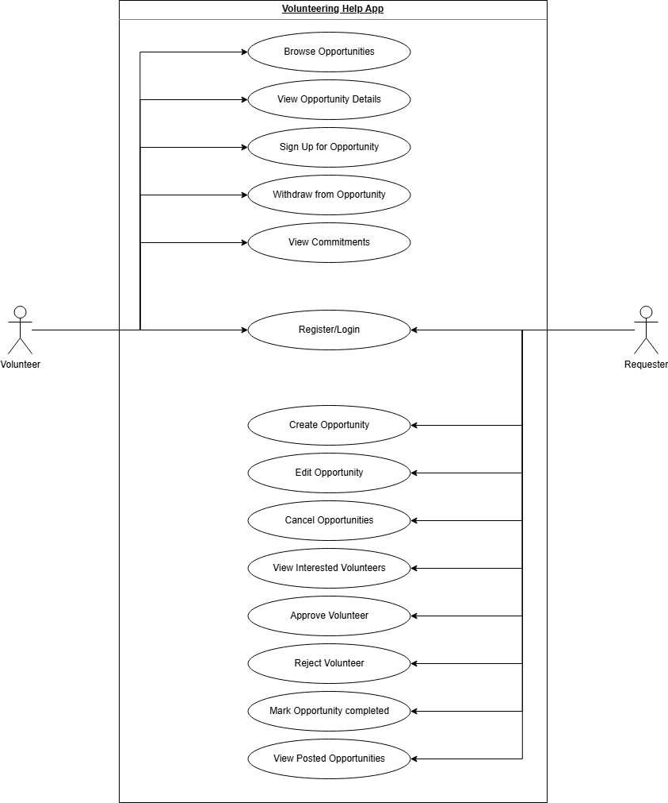

# PROJECT Design Documentation

## Team Information
* Team name: TEAMNAME
* Team members
  * Gauri Shedge
  * Catherine Roe
  * Michael Kingsley
  * Chase Michael
  * Rishi Parmar

## Executive Summary

The Volunteering Help App is designed to connect people who need assistance with volunteers willing to help in their communities. Many individuals require support for tasks such as organizing events, tutoring, or transportation, but finding reliable volunteers can be difficult. At the same time, people interested in volunteering often struggle to find suitable opportunities.
This application provides a centralized platform where requesters can post volunteer opportunities and volunteers can browse and participate in them. By bringing both groups together in one system, the app improves communication, organization, and accessibility of volunteering activities. The project demonstrates how technology can support community engagement while helping the team gain experience in full-stack application development.

## Requirements

The Volunteering Help App provides functionality for both volunteers and requesters to interact within a volunteer opportunity system.

Key requirements include:

1.Users must be able to register and log in to the platform.
2.Requesters must be able to create, edit, and cancel volunteer opportunities.
3.Volunteers must be able to browse opportunities and sign up for them.
4.Requesters must be able to approve or reject volunteers.
5.Users must be able to track and manage their volunteer commitments.
6.These requirements allow the system to support the complete volunteer coordination workflow.

### Definition of MVP
The Minimum Viable Product (MVP) is a functional version of the application that supports the basic workflow of posting volunteer opportunities and allowing volunteers to participate in them.
The MVP allows requesters to create and manage opportunities while volunteers can browse opportunities and sign up. Requesters can then review volunteers and mark opportunities as completed. This provides a working demonstration of the core platform functionality.

### MVP Features
The MVP includes the following main features:
1.User Authentication – Users can register and log into the platform.
2.Create Opportunities – Requesters can post volunteer opportunities.
3.Browse Opportunities – Volunteers can view available opportunities.
4.Sign Up for Opportunities – Volunteers can register for events.
5.Volunteer Management – Requesters can approve or reject volunteers.
6.Track Commitments – Volunteers can view their registered activities.
7.Opportunity Completion – Requesters can mark opportunities as completed.

## Architecture and Design

This section explains the overall design of the Volunteering Help App and how the different parts of the system work together. The application is built using an architecture that separates the user interface, application logic, and data storage. This separation helps keep the system organized and makes it easier to maintain and improve in the future.
Users access the application through a web browser where they can browse volunteer opportunities, create requests for help, and manage their participation. When a user performs an action, the system processes the request through different components that communicate with each other to retrieve or update the required information. This structure helps ensure the application runs smoothly and handles user interactions efficiently.

### Software Architecture

The application uses the Model–View–Controller (MVC) architecture.
View (React Components):
The frontend interface where users interact with the system through the browser. It displays opportunities, forms, and user dashboards.
Controller (React Event Controllers):
Handles user actions such as submitting forms or signing up for opportunities. The controller communicates between the view and the backend services.
Model (Flask / PostgreSQL):
Manages the application data and business logic. The backend built with Python Flask processes requests and stores information in the PostgreSQL database.
This architecture helps maintain a clear separation of responsibilities and improves scalability and maintainability.

### Use Cases

The system includes two main actors: Volunteers and Requesters.

# Volunteer actions:

1.Register or log in
2.Browse volunteer opportunities
3.View opportunity details
4.Sign up for opportunities
5.Withdraw from opportunities
6.View commitments

# Requester actions:

1.Create opportunities
2.Edit or cancel opportunities
3.View interested volunteers
4.Approve or reject volunteers
5.Mark opportunities as completed
6.View posted opportunities

